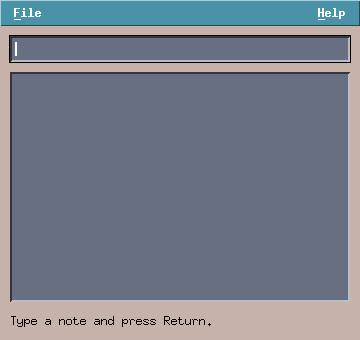

# libmtk

**A Motif-style widget toolkit on raw Xlib, in modern C.**

libmtk recreates the look and feel of classic Motif/CDE interfaces —
beveled 3D widgets, bitmap fonts, restrained colors — as a small,
dependency-light C23 library. It talks to the X server directly
through Xlib and XRender: no Xt, no Xm, no pixbuf library, no font
stack beyond the core X fonts the look calls for.



## Features

- **The classic widget set**: push/toggle buttons, labels, text
  entries, integer spinboxes, scrollbars, tabs, list boxes
  (multi-select, drag-to-reorder), lazy tree views, draggable pane
  sashes, a Motif-style file selection dialog, and a menu bar with
  pulldowns, mnemonics (Alt+F), keyboard navigation and the
  traditional right-aligned Help menu.
- **Themes** with four built-in looks (`steel`, `desert`,
  `platinum`, `graphite`), configured per user and per application
  through the X resource database — `myapp*MtkTheme: desert` via
  `xrdb`, exactly like the originals. Custom themes are one struct.
- **UTF-8 throughout** while keeping the bitmap-font aesthetic:
  text renders through X font sets, input goes through XIM, and the
  entry widget edits by code point.
- **Small and inspectable**: one public header, a static library, an
  event loop you can read in an afternoon.

## Requirements

- A C23 compiler (GCC ≥ 13 or Clang ≥ 16)
- meson and ninja
- libX11 and libXrender (headers)
- An X server with the classic core bitmap fonts (misc-fixed)

## Building and installing

```sh
meson setup build
ninja -C build          # static library + tutorial examples
ninja -C build install  # library, <mtk/mtk.h>, pkg-config "mtk"
```

## Using libmtk in your project

With meson, depend on the pkg-config name and (optionally) fall back
to a bundled copy so your project builds without a system install:

```meson
mtk_dep = dependency('mtk', fallback: ['libmtk', 'mtk_dep'])
```

The fallback resolves against `subprojects/libmtk` in your source
tree — a checkout, a symlink to one, or a wrap file:

```ini
# subprojects/libmtk.wrap
[wrap-git]
url = https://github.com/spegelref/libmtk.git
revision = head

[provide]
mtk = mtk_dep
```

Outside meson, plain pkg-config works:
`cc myapp.c $(pkg-config --cflags --libs mtk)`.

## Quick start

```c
#include <mtk/mtk.h>

static void clicked(MtkButton *b, void *data)
{
    mtk_label_set_text((MtkLabel *)data, "Thanks!");
}

static void layout(MtkWindow *win)
{
    /* the app owns layout: position widgets on (re)size */
    MtkLabel *l = win->user;
    mtk_widget_set_rect(&l->base, 10, 10, win->w - 20, 24);
}

int main(void)
{
    /* "hello" is the X resource name: users theme this program
     * with e.g. "hello*MtkTheme: desert" via xrdb */
    MtkApp *app = mtk_app_create("hello");
    if (!app)
        return 1;

    MtkWindow *win = mtk_window_create(app, "Hello", 240, 90);
    MtkLabel *l = mtk_label_create(win, nullptr, "Press the button");
    MtkButton *b = mtk_button_create(win, nullptr, "OK", clicked, l);
    mtk_widget_set_rect(&b->base, 10, 44, 80, 26);
    win->user = l;
    win->on_resize = layout;
    layout(win);

    mtk_window_show(win);
    mtk_app_run(app);                        /* returns when the    */
    mtk_app_destroy(app);                    /* last window closes  */
    return 0;
}
```

## Documentation

- **[The tutorial](tutorial/)** — five chapters from a first window
  to custom widgets, menus and theming, each built around a complete
  program that compiles with the library
  (`build/tutorial/examples/tut-*`). Start here.
- **API reference** — every public type and function is documented
  in [`include/mtk/mtk.h`](include/mtk/mtk.h); run `doxygen` in the
  project root to generate the HTML reference in `docs/api/html/`.
- **[Pitfalls](docs/pitfalls.md)** — the short list of mistakes that
  cost the most debugging time.
- The rest of this README is the design reference: the concepts and
  contracts the API is built on.

## Design

- **One X window per toplevel.** Widgets are *not* X windows. They
  are lightweight rectangles ("gadgets" in Motif terminology) that
  the toolkit hit-tests, draws and focuses itself. This keeps the
  server-side footprint tiny and makes flicker-free double buffering
  trivial.
- **Immediate-mode drawing into a retained back buffer.** Every
  damaged window is fully repainted: background fill, then each
  visible widget's `draw` in tree order (parents before children,
  siblings in creation order — creation order is z-order). The back
  buffer is then copied to the window in one `XCopyArea`.
- **The toolkit owns the main loop.** `mtk_app_run` polls the X
  connection, dispatches events, fires timers, repaints damaged
  windows, and runs an idle hook when there is nothing else to do.
- **C, not C++ in disguise.** "Inheritance" is a struct whose first
  member is `MtkWidget`; "virtual functions" are a const ops table.

### MtkApp

Created once with `mtk_app_create()` (connects to the display, loads
fonts, computes the palette). `mtk_app_run()` blocks until
`mtk_app_quit()` is called or every window is destroyed.
`mtk_app_destroy()` tears everything down.

### MtkWindow

A managed toplevel. Fields the application is expected to set after
creation:

| hook | called when |
| --- | --- |
| `on_resize` | size changed — do your layout here |
| `on_key` | key press not consumed by the focused widget |
| `on_close` | WM close button (default: destroy the window) |
| `on_destroy` | during teardown — free your `user` state here |
| `user` | your pointer, never touched by the toolkit |

`mtk_window_destroy()` only *marks* the window; actual teardown is
deferred to the end of the event-loop iteration, so it is always safe
to call from any callback, including handlers on the window being
destroyed. `mtk_window_set_fullscreen()` uses EWMH and fullscreens
on the monitor the window is on.

### MtkWidget — the gadget model

Every widget struct embeds `MtkWidget base;` as its **first member**,
so `(MtkWidget *)` and back-casts are valid. A widget is defined by a
static const `MtkWidgetOps`:

```c
struct MtkWidgetOps {
    void (*draw)(MtkWidget *w);                     /* paint into back buffer */
    bool (*event)(MtkWidget *w, XEvent *ev);        /* mouse; true = consumed */
    bool (*key)(MtkWidget *w, XKeyEvent *, KeySym, const char *text);
    void (*destroy)(MtkWidget *w);                  /* free owned memory      */
};
```

Rules the toolkit guarantees / expects:

- **Coordinates are window-absolute.** `w->x/y/w/h` are in window
  pixels; there is no per-widget origin translation. Layout code
  (the application) computes absolute rectangles.
- **Constructors allocate, `destroy` frees.** `ops->destroy` is
  called after children are gone and must free the widget struct
  itself. Never touch a widget after `mtk_widget_destroy(w)`.
- **Passing `parent = nullptr`** to a constructor parents the widget
  to the window root.
- **Mouse routing:** on ButtonPress the deepest visible widget under
  the pointer whose ops has `event` receives the event and becomes
  the **grab**: motion and release go to it until the button is
  released, even outside its rectangle. Scroll-wheel presses
  (buttons 4-7) are routed by position, without grabbing, and bubble
  up the ancestor chain until a handler consumes them (so a spinbox
  steps even when the wheel turns over its embedded entry).
- **Double clicks:** during a ButtonPress dispatch,
  `w->win->click_double` is true if this is the second click. There
  is no separate event.
- **Keyboard focus:** clicking a widget with `can_focus = true`
  focuses it (clicking anything else clears focus). The focused
  widget's `key` op sees keys first; unconsumed keys fall through to
  the window's `on_key`.
- **Repainting is whole-window.** There is no partial damage
  tracking: any `mtk_window_damage()` (which `mtk_widget_set_rect`
  etc. call for you) schedules a full repaint of that window on the
  next loop iteration. Draw handlers must therefore be cheap; cache
  expensive pixel work between repaints instead of recomputing it in
  `draw`.

### Timers and idle work

```c
int id = mtk_timer_add(app, ms, cb, data);  /* one-shot */
mtk_timer_cancel(app, id);
mtk_app_set_idle(app, fn, data);            /* fn returns true = more work */
```

Timers are one-shot: re-add from the callback for periodic behavior
(clocks, animation). Ids are never 0, so 0 can mean "no timer".
The idle hook runs only when no X events are pending and no timer is
due — the place for background work like loading thumbnails or
indexing files without blocking the UI.

### Drawing API

All drawing happens inside `ops->draw`, targeting the window back
buffer, using the palette in `w->win->app->pal`:

```c
mtk_fill_rect / mtk_draw_rect            solid rectangles
mtk_draw_bevel(win,x,y,w,h,t,sunken)     the Motif 3D edge
mtk_draw_bevel_c                         bevel with explicit colors
mtk_draw_etched                          groove frame
mtk_draw_arrow                           shaded triangle (4 directions)
mtk_draw_text / mtk_draw_text_centered   UTF-8 bitmap-font text
mtk_set_clip / mtk_clear_clip            clip rect (ALWAYS pair them)
```

Three rules with sharp edges:

1. **`mtk_set_clip` must be paired with `mtk_clear_clip`** on every
   exit path — the clip lives on the shared per-window GC *and* on
   the back-buffer XRender picture, so a leaked clip corrupts every
   widget drawn after you.
2. **Any content that can extend past your rectangle must be drawn
   under a clip.** The clip covers both core drawing and XRender
   composites (`XRenderComposite` ignores GC state; the toolkit clips
   the destination picture for you).
3. **Text is UTF-8**, rendered through X font *sets*
   (`XmbDrawString`): multiple core bitmap fonts cover the locale, so
   the classic bitmap look is kept while text is international.
   Glyph coverage follows the installed core fonts — misc-fixed
   supplies broad Latin/Cyrillic/Greek/Japanese coverage everywhere;
   charsets with no installed bitmap font (e.g. GB2312 for simplified
   Chinese) render as garbage glyphs until such a font is installed.
   `mtk_utf8_next` / `mtk_utf8_prev` step over code-point boundaries
   when you need to slice strings (elision, cursors).

Custom widgets that composite images can create XRender pictures
against `app->fmt_argb32` (premultiplied ARGB32 words) and composite
onto `win->back_pict` — upload pixels with `XPutImage` into a
depth-32 pixmap and give it a `Picture`; the clip installed by
`mtk_set_clip` applies.

### Themes

Colors come in four groups plus one accent, and every widget picks
from the group it lives in:

| group | used by | palette fields |
| --- | --- | --- |
| **body** | windows, buttons, panels, pulldowns, tabs | `bg`, `top_shadow`, `bottom_shadow`, `text`, `select` (trough) |
| **surface** | compact content wells: entries, lists, trees | `surface`, `surface_top`, `surface_bottom`, `surface_text` |
| **muted** | large canvas wells: icon grids, previews | `muted`, `muted_top`, `muted_bottom`, `muted_text` |
| **primary** | menubar, selections, toggled-on buttons | `primary`, `primary_top`, `primary_bottom`, `primary_text` |
| **active** | momentarily armed controls (pressed buttons/arrows) | `active` |

A theme that does not specify `muted` gets the surface tone for it,
so canvas areas only differ where a theme wants them to.

A theme (`MtkTheme`) specifies each group as a `MtkThemeGroup{ bg,
shadow, highlight, light_text }`; zero shadow/highlight fields are
derived from the group's `bg` the way Motif derived shadows from
`XmNbackground` (×1.45 light, ×0.45 dark). This lets dark wells get
light text and their own bevel shading.

Users select a theme the classic Motif way, through the X resource
database (`xrdb`):

```sh
echo 'myapp*MtkTheme: desert' | xrdb -merge    # one application
echo '*MtkTheme: graphite' | xrdb -merge       # all libmtk apps
```

The resource is read at `mtk_app_create(res_name)` as instance
`<res_name>.mtkTheme`, class `<Res_name>.MtkTheme` (so both
spellings match). Precedence: X resource, then `$MTK_THEME`, then
the built-in default. Programs can still override at any time:

```c
mtk_app_set_theme(app, mtk_theme_find("desert"));
```

| name | look |
| --- | --- |
| `steel` | bluish grey (default; mwm-ish) |
| `desert` (alias `cde`) | CDE: clay body, slate wells with white text, muted-clay canvas, teal menubar/selection, orange armed accent |
| `platinum` (alias `ice`) | grey body, white wells, near-black selection (IceWM Motif) |
| `graphite` | dark: charcoal body, near-black wells, slate-blue selection, amber armed accent |

Themes carry a human-readable `label` ("Desert") next to their
lookup `name`. Custom themes are just an `MtkTheme` struct you pass
in; widgets read `app->pal` on every draw, so switching at runtime
repaints correctly.

When drawing custom widgets, match the group to the ground you draw
on: text on a well is `surface_text` / `muted_text` (never `text`),
a well's sunken frame is `mtk_draw_bevel_c(...)` with that group's
top/bottom pair, and a selection highlight is `primary` +
`primary_text`. Compact data widgets take the surface tone; large
canvases (icon grids, preview areas) take the muted tone.

## Widget catalog

| widget | constructor | notes |
| --- | --- | --- |
| `MtkButton` | `mtk_button_create` | push or toggle (`mtk_button_set_toggle`); `on_click` after release inside |
| `MtkLabel` | `mtk_label_create` | `align`, `bold` fields; clips its text |
| `MtkEntry` | `mtk_entry_create` | single-line UTF-8 editor (cursor moves by code point); `validate` filters input one encoded code point at a time, `on_activate` = Return |
| `MtkSpinbox` | `mtk_spinbox_create` | entry + joined up/down arrows; digits only, clamped to [min,max]; wheel steps |
| `MtkScrollbar` | `mtk_scrollbar_create` | Motif trough/thumb/arrows; `mtk_scrollbar_config(min,max,page,line)`, `on_change` |
| `MtkTabs` | `mtk_tabs_create` | tab *bar* only; the app shows/hides panels in `on_change` |
| `MtkListbox` | `mtk_listbox_create` | scrolling string list; `on_select` / `on_activate` (double click, Return) / `on_delete` (Delete key); see below for multi-select and reorder |
| `MtkTree` | `mtk_tree_create` | lazy tree: `on_expand` populates a node's children on first expansion via `mtk_tree_node_add` |
| `MtkSash` | `mtk_sash_create` | draggable vertical divider; reports new x in `on_drag`, app relayouts |
| `MtkMenuBar` | `mtk_menubar_create` | menu bar + pulldowns; see below |
| `MtkFileDialog` | `mtk_file_dialog` | XmFileSelectionBox-style open/save dialog in its own toplevel; fires `on_done` once (path or nullptr) and destroys itself |

### Listbox selection and reordering

Setting `lb->multi = true` enables file-manager selection: plain
click selects one row, **Ctrl+click** toggles a row, **Shift+click**
selects the range from the last plain click. `lb->marked[i]` holds
the set, `lb->selected` is the lead row (drawn with an outline), and
`mtk_listbox_any_marked` / `mtk_listbox_clear_marks` help the app.
`on_select` still fires with the lead index.

Setting `lb->reorderable = true` lets the user drag a row to a new
position; an insertion bar tracks the pointer and `on_reorder(lb,
from, to)` fires after the widget has already moved its own row — the
application mirrors the move in any parallel array it keeps.

### Menu bar

```c
static const MtkMenuEntry file_menu[] = {
    {"Open...", nullptr},
    {"-", nullptr},          /* separator */
    {"Quit", "Ctrl+Q"},      /* accel is display-only */
};
MtkMenuBar *mb = mtk_menubar_create(win, nullptr, on_pick, app);
mtk_menubar_add(mb, "File", file_menu, 3);
```

`on_pick(mb, menu, item, data)` receives the indices as added
(separators count, but are never picked). Accelerator strings are
hints only — bind the real shortcut in the window's `on_key`.

**Mnemonics and keyboard navigation.** Each title's first letter is
its mnemonic, drawn underlined in the bar, Motif style. Route your
window's unconsumed keys through the menu bar to activate them:

```c
static bool on_key(MtkWindow *win, XKeyEvent *ev, KeySym sym,
                   const char *text)
{
    App *a = win->user;
    return mtk_menubar_key(a->menubar, ev, sym);
}
```

Then **Alt+F** opens the File menu and **F10** opens the first one.
While a pulldown is open, Up/Down move the highlight, Return picks,
Left/Right switch to the neighbouring menu, Alt+another-mnemonic
jumps, and Escape closes. Entries ignore Alt-modified input, so the
accelerators work even while a text field has focus.

**The help menu.** Motif attached the Help menu to the far right of
the bar; do the same with:

```c
int help = mtk_menubar_add(mb, "Help", help_menu, 1);
mtk_menubar_set_help(mb, help);
```

Pulldowns are **override-redirect popup windows**
(`mtk_window_create_popup`) with a pointer+keyboard grab, so they can
extend past the toplevel and close on any outside click (clicking
another title switches menus; press-drag-release onto an item picks
it). If you build similar transient UI, follow the same pattern:
create the popup, grab, and use the window's `on_unhandled_press`
hook to catch grabbed clicks that land outside every widget.

Constructors return the concrete struct; widgets are positioned with
`mtk_widget_set_rect(&w->base, ...)` and shown/hidden with
`mtk_widget_set_visible`. Compound widgets (spinbox, listbox, tree)
own internal children — never destroy those directly.

## Writing a new widget

1. Define the struct with `MtkWidget base;` first.
2. Write `draw` (read colors from `w->win->app->pal`, respect your
   rectangle, clip anything that might overflow).
3. Write `event` / `key` as needed; return `true` when consumed.
4. Write `destroy` freeing owned resources *and the struct*.
5. Constructor: `calloc`, `mtk_widget_init(&x->base, win, parent,
   &ops)`, set fields, return.

Chapter 4 of the tutorial builds a complete custom widget this way.
Widgets that are generic belong in the library; application-specific
canvases (an image viewer, a data plot) implement `MtkWidgetOps`
inside the application — that is the intended extension mechanism,
not subclassing inside the library.

## License

**LGPL 2.1 only** — see [LICENSE](LICENSE).

In practice: applications may link against libmtk (statically or
dynamically) under whatever license they choose, but changes to the
library itself must be published under the same terms, and users must
be able to relink your application against a modified libmtk —
dynamic linking against the shared library satisfies that
automatically. This project is licensed under LGPL version 2.1
*only*; the "or any later version" upgrade clause is deliberately not
granted.
