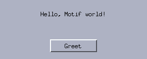

# 1. Your first window

*Program: [`examples/01-hello.c`](examples/01-hello.c)*



Every libmtk program has the same skeleton: create an **application**,
create a **window**, put **widgets** in it, and hand control to the
**main loop**. We will build a window with a label and a button that
changes the label's text — about forty lines of C.

## The application object

```c
MtkApp *app = mtk_app_create("hello");
if (!app)
    return 1;
```

`mtk_app_create` connects to the X server, loads the fonts, computes
the color palette and prepares the input method. It returns
`nullptr` (note: C23's `nullptr`, which libmtk uses throughout) if no
display is available, so a program should check and give up politely.

The string `"hello"` is the application's *X resource name*. You will
meet it again in chapter 5 — it is how users configure your program
from the outside, for example choosing a theme with `xrdb`. Pick a
short lowercase name and keep it stable.

## A window and two widgets

```c
MtkWindow *win = mtk_window_create(app, "Hello", 300, 120);

Ui ui = {0};
ui.message = mtk_label_create(win, nullptr, "A humble beginning.");
ui.message->align = MTK_ALIGN_CENTER;
ui.button = mtk_button_create(win, nullptr, "Greet", on_greet, &ui);
```

Three things worth pausing on:

**Widgets are not windows.** In libmtk (as in original Motif's
"gadgets") a widget is a lightweight rectangle inside its toplevel
window. The toolkit draws it, routes mouse clicks to it and manages
keyboard focus — but as far as the X server is concerned there is
only one window. The second argument to every constructor is the
parent widget; `nullptr` means "directly inside the window".

**Configuration is plain struct access.** There are no setter
functions for simple properties: `ui.message->align =
MTK_ALIGN_CENTER;` is the whole API. Fields that need redrawing or
memory management have functions (`mtk_label_set_text`), everything
else you just assign.

**Callbacks carry a `void *data` of your choosing.** The button was
given `on_greet` and `&ui`:

```c
static void on_greet(MtkButton *b, void *data)
{
    (void)b;
    Ui *ui = data;
    mtk_label_set_text(ui->message, "Hello, Motif world!");
}
```

Grouping your widgets in a small struct (here `Ui`) and passing its
address around is the idiomatic pattern — you will see it in every
chapter of this tutorial.

## Layout is your job

libmtk has no layout managers. The application positions every
widget, in window coordinates, whenever the window changes size:

```c
static void layout(MtkWindow *win)
{
    Ui *ui = win->user;
    mtk_widget_set_rect(&ui->message->base, 12, 16, win->w - 24, 24);
    mtk_widget_set_rect(&ui->button->base, (win->w - 96) / 2,
                        win->h - 40, 96, 26);
}
```

Two conventions appear here:

- Every widget struct embeds `MtkWidget base;` as its first member,
  and generic functions take `&widget->base`. This is C's classic
  hand-rolled inheritance; casting back and forth is well-defined
  because `base` is first.
- `win->user` is a pointer the toolkit never touches. Store your
  state struct there and every window callback can reach it.

Wire the function up and call it once by hand for the initial
geometry:

```c
win->user = &ui;
win->on_resize = layout;
layout(win);
```

Doing layout with arithmetic sounds primitive, and it is — that's
the point. There is nothing to fight: centering is `(win->w - w) /
2`, a bottom bar is `win->h - height`, a two-column split is a
division. For the window sizes Motif-style programs use, this stays
perfectly manageable.

## The main loop

```c
mtk_window_show(win);
mtk_app_run(app);
mtk_app_destroy(app);
return 0;
```

`mtk_app_run` blocks, dispatching events until either
`mtk_app_quit(app)` is called or the last window is closed (the
window-manager close button destroys the window by default). After
it returns, `mtk_app_destroy` releases everything.

Note what we did **not** write: no event switch, no redraw handling,
no expose events. The toolkit repaints damaged windows by itself;
your code only changes state (`mtk_label_set_text`) and the update
follows.

## Try it

```sh
./build/tutorial/examples/tut-01-hello
```

Resize the window — the label stretches and the button stays
centered at the bottom, because `layout` runs on every size change.

**Exercises**

1. Add a second button that restores the original text.
2. Make the label bold (`ui.message->bold = true`).
3. Give the window a minimum useful size by clamping the values in
   `layout` — what happens without it when you make the window tiny?

Next: [Events, layout and timers](02-events-layout-timers.md).
