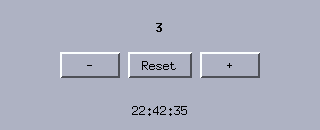

# 2. Events, layout and timers

*Program: [`examples/02-counter.c`](examples/02-counter.c)*



A counter you can drive with buttons **or** the keyboard, plus a
clock that updates every second. Along the way, this chapter
explains how an event actually travels from the X server to your
callback.

## The event model, end to end

You never see raw X events unless you write a custom widget
(chapter 4). The toolkit's main loop does this on every iteration:

1. **Read X events.** Mouse and key events are looked up against the
   widget tree of the window they arrived in.
2. **Mouse routing.** A button press goes to the *deepest visible
   widget under the pointer* that handles events. That widget also
   becomes the "grab": until the button is released, motion and the
   release go to it even if the pointer leaves its rectangle (this is
   why dragging a scrollbar thumb keeps working when you overshoot).
   Wheel events are routed by position only.
3. **Keyboard routing.** A key press first goes to the *focused*
   widget, if any — clicking an entry focuses it. If no widget
   consumes the key, it falls through to the window's `on_key` hook.
   That fall-through is where application shortcuts live.
4. **Timers fire**, **damaged windows repaint**, and the loop sleeps
   until something happens.

So a libmtk program is callbacks all the way down: widget callbacks
for widget things (`on_click`, `on_change`), window hooks for window
things (`on_resize`, `on_key`, `on_close`), and timers for time.

## Window-level keyboard input

The counter reacts to the arrow keys and quits on `q` or Escape:

```c
static bool on_key(MtkWindow *win, XKeyEvent *ev, KeySym sym,
                   const char *text)
{
    (void)ev;
    (void)text;
    Ui *ui = win->user;
    switch (sym) {
    case XK_Up:
    case XK_plus:
        ui->count++;
        show_count(ui);
        return true;
    case XK_Down:
    case XK_minus:
        ui->count--;
        show_count(ui);
        return true;
    case XK_q:
    case XK_Escape:
        mtk_window_destroy(win);
        return true;
    }
    return false;
}
```

The `sym` is an X *keysym* — a layout-independent name for the key
(`XK_Up`, `XK_q`; the constants come from `<X11/keysym.h>`, which
`mtk/mtk.h` already includes). The `text` argument is the character
the key produces as UTF-8 text, if any; entries use it, shortcuts
usually want the keysym. Return `true` when you consumed the key.

Check modifiers through the raw event when you need them:
`ev->state & ControlMask` is Ctrl, `ShiftMask` is Shift.

One subtlety: `mtk_window_destroy` inside a callback is always safe.
The window is only *marked*; actual teardown happens at the end of
the loop iteration, after your callback has returned.

## Repeating timers

libmtk timers are **one-shot**. A clock is a callback that
re-schedules itself:

```c
static void tick(void *data)
{
    Ui *ui = data;
    time_t now = time(nullptr);
    char buf[32];
    strftime(buf, sizeof(buf), "%H:%M:%S", localtime(&now));
    mtk_label_set_text(ui->clock, buf);
    mtk_timer_add(ui->app, 1000, tick, ui);
}
```

Call `tick(&ui)` once before `mtk_app_run` and it keeps itself alive
forever. `mtk_timer_add` returns an id (never 0) that
`mtk_timer_cancel` accepts — store it if the timer must stop before
the program does, and *always* cancel timers owned by a widget in
that widget's destroy handler, because a timer does not know its
widget died.

This one-shot design sounds spartan but composes well: an animation
whose frame delays vary (a GIF player, say) simply re-adds itself
with a different delay each time.

## Layout, again

The counter's `layout` centers a row of three buttons:

```c
static void layout(MtkWindow *win)
{
    Ui *ui = win->user;
    int mid = win->w / 2;
    mtk_widget_set_rect(&ui->value->base, 12, 14, win->w - 24, 28);
    mtk_widget_set_rect(&ui->minus->base, mid - 100, 52, 60, 26);
    mtk_widget_set_rect(&ui->reset->base, mid - 32, 52, 64, 26);
    mtk_widget_set_rect(&ui->plus->base, mid + 40, 52, 60, 26);
    mtk_widget_set_rect(&ui->clock->base, 12, win->h - 30, win->w - 24,
                        20);
}
```

A useful habit: lay rows out relative to *anchors* — the horizontal
middle, the bottom edge — rather than absolute positions. Then
resizing does the right thing with no extra code.

If you need a draggable divider between two areas, the toolkit has
`MtkSash`; it reports the new split position and you re-run your
layout — a classic two-pane file-browser split is exactly that.

## Try it

```sh
./build/tutorial/examples/tut-02-counter
```

Click the buttons, then try the arrow keys, then `q`.

**Exercises**

1. Make `+` and `-` step by 10 when Shift is held
   (`ev->state & ShiftMask`).
2. Add a "lap" feature: a label that freezes the current clock text
   when you press the space bar.
3. Change the clock to update every 100 ms and show tenths of a
   second. What is the cost of a too-fast timer?

Next: [The standard widgets](03-standard-widgets.md).
