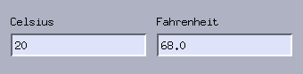
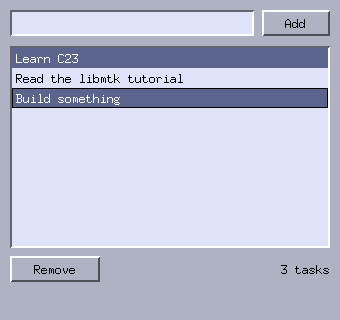

# 3. The standard widgets

*Programs: [`examples/03-convert.c`](examples/03-convert.c) and
[`examples/03-tasks.c`](examples/03-tasks.c)*

Two small applications this time. A temperature converter introduces
text entries; a to-do list introduces the list box and shows how the
selection model works.

## Entries and validation: the converter



Two `MtkEntry` fields, each recomputing the other as you type. The
interesting part is input filtering:

```c
static bool numeric(MtkEntry *e, const char *ch, void *data)
{
    (void)data;
    if (ch[0] >= '0' && ch[0] <= '9' && ch[1] == '\0')
        return true;
    if (ch[0] == '-' && ch[1] == '\0')
        return e->cursor == 0 && e->text[0] != '-';
    if (ch[0] == '.' && ch[1] == '\0')
        return !strchr(e->text, '.');
    return false;
}
```

The `validate` hook runs before each character is inserted; return
`false` to reject it. `ch` is one **UTF-8 encoded code point**, not a
single byte — libmtk text is UTF-8 throughout — which is why the
digit test also checks `ch[1] == '\0'` (a multi-byte character like
`é` is not a digit even though its first byte might pass a naive
range test). The hook can inspect the entry's current state:
rejecting a second minus sign or decimal point is one comparison.

Reacting to edits is the `on_change` hook. Two entries that update
each other will recurse forever unless you break the cycle; a bool
guard is the standard trick:

```c
static void c_changed(MtkEntry *e, void *data)
{
    Ui *ui = data;
    if (!ui->updating)
        set_value(ui, ui->fahrenheit, atof(mtk_entry_text(e)) * 9 / 5 + 32);
}
```

where `set_value` sets `ui->updating = true` around its call to
`mtk_entry_set_text`.

Other entry hooks you will use: `on_activate` fires on Return
(perfect for "submit"), and `MtkSpinbox` wraps an entry with joined
up/down arrows for clamped integer input — it is the same validation
machinery preconfigured for digits.

## Lists and selection: the to-do app



The to-do list wires an entry, a list box and two buttons together.
Adding is two lines:

```c
mtk_listbox_add(ui->list, mtk_entry_text(ui->input));
mtk_entry_set_text(ui->input, "");
```

The list box was configured at creation time:

```c
ui.list = mtk_listbox_create(win, nullptr);
ui.list->multi = true;
ui.list->reorderable = true;
ui.list->on_delete = on_delete_key;
ui.list->data = &ui;
```

`multi` enables the file-manager selection model: plain click
selects one row, **Ctrl+click** toggles a row in and out of the
selection, **Shift+click** selects the range from the last plain
click. The widget keeps the state in two places:

- `lb->marked[i]` — whether row *i* is in the selection;
- `lb->selected` — the *lead* row (the last one clicked), drawn with
  an outline.

Operating on the selection is then an ordinary loop. Note it runs
backwards — removing row *i* shifts every later row down, so forward
iteration would skip rows:

```c
static void remove_selected(Ui *ui)
{
    MtkListbox *lb = ui->list;
    if (mtk_listbox_any_marked(lb)) {
        for (int i = lb->nitems - 1; i >= 0; i--)
            if (lb->marked[i])
                mtk_listbox_remove(lb, i);
    } else if (lb->selected >= 0) {
        mtk_listbox_remove(lb, lb->selected);
    }
    update_status(ui);
}
```

`reorderable` lets the user drag a row to a new position; an
insertion bar follows the pointer. If your application keeps a
parallel array alongside the rows (a playlist keeping file paths,
say — the to-do app does not), the `on_reorder(lb, from, to)` hook
tells you to mirror the move.

Other list hooks: `on_select` (lead changed), `on_activate`
(double-click or Return), `on_delete` (Delete/Backspace pressed —
the to-do app routes it into the same `remove_selected`).

Scrolling is automatic: the list box owns an `MtkScrollbar` child
and shows it only when needed. You only meet `MtkScrollbar` directly
when writing custom widgets.

## Focus

One line in `main` is easy to overlook:

```c
mtk_window_set_focus(win, &ui.input->base);
```

Focus normally follows clicks, but a freshly opened window has no
focus at all — set it so the user can start typing immediately.
Widgets with `can_focus` (entries, list boxes) receive keys first;
everything else falls through to `win->on_key` as in chapter 2.

## Try it

```sh
./build/tutorial/examples/tut-03-convert
./build/tutorial/examples/tut-03-tasks
```

In the to-do app: add a few tasks, Ctrl-click two of them, press
Delete. Then grab a row and drag it up.

**Exercises**

1. Converter: add a Kelvin field. The guard flag pattern extends to
   three fields unchanged.
2. Tasks: show "3 tasks, 2 selected" in the status label
   (`on_select` fires whenever the lead changes).
3. Tasks: persist the list — write one line per row on quit
   (`win->on_close`) and read it back at startup. Chapter 5's notes
   app shows a file dialog if you want one.

Next: [Writing your own widget](04-custom-widgets.md).
