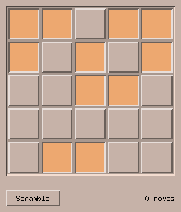

# 4. Writing your own widget

*Program: [`examples/04-lights.c`](examples/04-lights.c)*



The built-in widgets cover forms and lists, but sooner or later you
need something of your own — a chart, a game board, an image canvas.
In libmtk a custom widget is not a special privilege: you use exactly
the same mechanism the built-in widgets are made of. This chapter
builds a small "lights out" puzzle: click a cell and it toggles
together with its four neighbours; turn the whole board off to win.

## Anatomy of a widget

A widget is a struct that embeds `MtkWidget` as its **first member**,
plus a table of function pointers:

```c
typedef struct LightBoard {
    MtkWidget base;                    /* must be the first member */
    bool on[GRID][GRID];
    int moves;
    void (*on_change)(struct LightBoard *lb, void *data);
    void *data;
} LightBoard;

static const MtkWidgetOps board_ops = {
    .draw = board_draw,
    .event = board_event,
    .destroy = board_destroy,
};
```

The ops table has four optional slots:

| op | called when | you return |
| --- | --- | --- |
| `draw` | the window repaints | — |
| `event` | mouse press/motion/release inside you | `true` if consumed |
| `key` | a key arrives while you have focus | `true` if consumed |
| `destroy` | your widget is being freed | — |

The constructor allocates, initializes the base, and returns the
concrete type — the same shape as every `mtk_*_create`:

```c
static LightBoard *board_create(MtkWindow *win, MtkWidget *parent)
{
    LightBoard *lb = calloc(1, sizeof(*lb));
    mtk_widget_init(&lb->base, win, parent, &board_ops);
    return lb;
}
```

And the destroy op frees what the constructor allocated — including
the struct itself:

```c
static void board_destroy(MtkWidget *w)
{
    free(w); /* frees the whole LightBoard */
}
```

That is the ownership contract in one sentence: *constructors
allocate, `destroy` frees, and nobody touches a widget after
`mtk_widget_destroy`.*

## Drawing with the theme palette

`draw` runs whenever the window repaints. You draw into the window's
back buffer using the `mtk_draw_*`/`mtk_fill_*` helpers, in window
coordinates, inside your own rectangle (`w->x`, `w->y`, `w->w`,
`w->h`):

```c
static void board_draw(MtkWidget *w)
{
    LightBoard *lb = (LightBoard *)w;
    MtkWindow *win = w->win;
    MtkPalette *p = &win->app->pal;

    mtk_fill_rect(win, w->x, w->y, w->w, w->h, p->muted);
    mtk_draw_bevel_c(win, w->x, w->y, w->w, w->h, MTK_BEVEL, true,
                     p->muted_top, p->muted_bottom);

    for (int cy = 0; cy < GRID; cy++)
        for (int cx = 0; cx < GRID; cx++) {
            int x, y, cw, ch;
            board_cell_rect(lb, cx, cy, &x, &y, &cw, &ch);
            bool lit = lb->on[cy][cx];
            mtk_fill_rect(win, x + 2, y + 2, cw - 4, ch - 4,
                          lit ? p->active : p->bg);
            mtk_draw_bevel(win, x + 2, y + 2, cw - 4, ch - 4,
                           MTK_BEVEL, lit);
        }
}
```

Never hardcode colors — pick them from `win->app->pal`, matching the
*ground* you draw on:

- **body** (`bg`, `top_shadow`, `bottom_shadow`, `text`) for
  button-like, panel-like things;
- **surface** / **muted** groups for content wells (compact and
  large, respectively) — note the board frame uses
  `mtk_draw_bevel_c` with the muted pair, because a plain
  `mtk_draw_bevel` would shade with body colors;
- **primary** for selection, **active** for pressed/lit states — the
  lit cells above are `p->active`, which is what makes them orange
  in the desert theme with zero effort on our part.

Follow this and your widget automatically looks right in every theme,
including ones that do not exist yet.

Two more drawing rules from the toolkit reference apply verbatim to
custom widgets: anything that might paint outside your rectangle must
be wrapped in `mtk_set_clip` / `mtk_clear_clip` (paired on **every**
return path), and text is drawn with `mtk_draw_text_centered(win,
win->app->font, ...)` in UTF-8.

## Handling input

Mouse events arrive as raw `XEvent`s, already routed to you:

```c
static bool board_event(MtkWidget *w, XEvent *ev)
{
    LightBoard *lb = (LightBoard *)w;
    if (ev->type != ButtonPress || ev->xbutton.button != Button1)
        return false;
    /* ... find the cell under (ev->xbutton.x, ev->xbutton.y),
       toggle it and its neighbours ... */
    mtk_window_damage(w->win);
    if (lb->on_change)
        lb->on_change(lb, lb->data);
    return true;
}
```

The pattern to internalize: **change state, call
`mtk_window_damage`, notify.** You never draw from an event handler
— damage schedules a repaint and your `draw` runs with the new
state. The `on_change` hook is the widget telling the application
"something happened"; giving your widgets hooks like this keeps them
reusable instead of welded to one program.

Double clicks: during a press dispatch, `w->win->click_double` is
true on the second click — read it in your event op if you need it.

## The application half

The rest of the program is chapter-1 material: the board plus a
Scramble button and a status label, laid out by hand. The
application-side callback turns board changes into status text:

```c
static void board_changed(LightBoard *lb, void *data)
{
    Ui *ui = data;
    char buf[64];
    if (board_solved(lb))
        snprintf(buf, sizeof(buf), "Solved in %d moves!", lb->moves);
    else
        snprintf(buf, sizeof(buf), "%d move%s", lb->moves,
                 lb->moves == 1 ? "" : "s");
    mtk_label_set_text(ui->status, buf);
}
```

Scrambling *toggles* random cells rather than randomizing them
independently — every toggle is reversible, so the puzzle is always
solvable. Not a GUI lesson, just good manners.

## Try it

```sh
./build/tutorial/examples/tut-04-lights
```

**Exercises**

1. Draw a keyboard cursor (a rectangle outline on one cell), make the
   board focusable (`lb->base.can_focus = true`), and implement a
   `key` op: arrows move the cursor, space toggles. Remember the
   focus-outline color is `p->highlight`.
2. Animate a win: on solve, start a one-shot timer chain (chapter 2)
   that flashes the board twice.
3. Extract the board into `lightboard.h`/`lightboard.c`. Nothing in
   it depends on the puzzle program — that separation between widget
   and application is exactly how larger application widgets (an
   image canvas, a thumbnail grid) should be built.

Next: [Menus, dialogs and X resources](05-menus-dialogs-resources.md).
