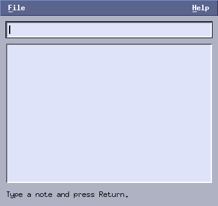

# 5. Menus, dialogs and X resources

*Program: [`examples/05-notes.c`](examples/05-notes.c)*



The finale ties the previous chapters together into a small note
keeper: a menu bar, a save/load dialog, an About box — and theming
the way Motif applications were themed, through the X resource
database.

## The menu bar

A menu is declared as data and added under a title:

```c
a.menubar = mtk_menubar_create(a.win, nullptr, menu_pick, &a);
static const MtkMenuEntry file_menu[] = {
    {"New", nullptr},
    {"Open...", nullptr},
    {"Save As...", nullptr},
    {"-", nullptr},          /* separator */
    {"Quit", nullptr},
};
mtk_menubar_add(a.menubar, "File", file_menu, 5);
```

The second `MtkMenuEntry` field is an accelerator *hint* like
`"Ctrl+Q"` — it is displayed right-aligned but not bound; real
shortcuts belong in `win->on_key` (chapter 2), which keeps working
whether or not a menu shows them.

Two Motif traditions come along automatically. First, each title's
first letter is its **mnemonic**, drawn underlined; route your
unconsumed keys through the menu bar and `Alt+F` opens File
(`F10` opens the first menu):

```c
static bool on_key(MtkWindow *win, XKeyEvent *ev, KeySym sym,
                   const char *text)
{
    (void)text;
    App *a = win->user;
    return mtk_menubar_key(a->menubar, ev, sym);
}
```

Once a menu is open the keyboard drives everything: Up/Down move,
Return picks, Left/Right switch menus, Escape closes. Second, the
**Help menu belongs at the far right** of the bar:

```c
int help = mtk_menubar_add(a.menubar, "Help", help_menu, 1);
mtk_menubar_set_help(a.menubar, help);
```

All picks land in one callback, identified by menu and item index
(separators count in the numbering but can never be picked):

```c
static void menu_pick(MtkMenuBar *mb, int menu, int item, void *data)
{
    App *a = data;
    if (menu == MENU_FILE) {
        switch (item) {
        case 0: mtk_listbox_clear(a->list); break;
        case 1: prompt_show(a, "Open Notes", do_load); break;
        case 2: prompt_show(a, "Save Notes As", do_save); break;
        case 4: mtk_app_quit(a->mtk); break;
        }
    } else if (menu == MENU_HELP && item == 0) {
        show_about(a);
    }
}
```

Behind the scenes each pulldown is an override-redirect popup window
with a pointer grab — click a title to open, click an item or
press-drag-release to pick, Escape or a click elsewhere to close.
You get all of that for free.

Remember to reserve room for the bar in your layout: it sits at
`(0, 0, win->w, MTK_MENUBAR_H)` and everything else starts below it.

## Dialogs are just windows

libmtk has no dialog class. A dialog is a second `MtkWindow` with a
few widgets and callbacks — the About box is fifteen lines. The
interesting one is the *prompt*: it asks for a file path and calls
back with the answer.

```c
typedef struct Prompt {
    App *a;
    MtkEntry *entry;
    void (*done)(App *a, const char *path);
} Prompt;
```

The prompt allocates its state on the heap, parks it in `win->user`,
and frees it in the window's `on_destroy` hook. The finish path is
worth reading carefully:

```c
static void prompt_finish(Prompt *p, MtkWindow *win)
{
    char path[1024];
    snprintf(path, sizeof(path), "%s", mtk_entry_text(p->entry));
    App *a = p->a;
    void (*done)(App *, const char *) = p->done;
    mtk_window_destroy(win); /* deferred: safe inside a callback */
    if (path[0])
        done(a, path);
}
```

Everything needed afterwards is copied to locals **before**
`mtk_window_destroy`, because destruction (even though deferred)
means `p` and the entry text must be treated as gone. This
copy-then-destroy-then-continue shape is the standard libmtk dialog
pattern; use it for every dialog that returns a value.

Note there is no modality: the main window stays usable while a
prompt is open. Classic Motif had modal dialogs; libmtk keeps the
toolkit smaller and leaves "don't do that while the dialog is open"
to the application — for a save prompt it rarely matters.

## Theming with X resources

libmtk applications are themed the way it was done historically: the
user sets a resource in the X resource database with `xrdb`, and
every program picks it up at startup.

```sh
# theme one application
echo 'notes*MtkTheme: desert' | xrdb -merge

# theme every libmtk application
echo '*MtkTheme: graphite' | xrdb -merge
```

Steel (default) and desert, same program, no code change:


To make settings permanent, put the line in `~/.Xresources` (loaded
by `xrdb` at session start on most setups). The resource is looked
up as instance `notes.mtkTheme`, class `Notes.MtkTheme` — so both
spellings work, and the leading component is the string your program
passed to `mtk_app_create("notes")`. That is why the resource name
should be short, lowercase and stable: it is your program's public
configuration identity.

The full precedence order: X resource, then the `MTK_THEME`
environment variable, then the built-in default. An application can
still force a theme with `mtk_app_set_theme` (a `--theme`
command-line flag is easy to offer that way), and can even switch at
runtime — every widget reads the palette on each repaint.

Built-in theme names: `steel`, `desert`, `platinum`, `graphite`.
A custom theme is a plain `MtkTheme` struct — see
[the toolkit reference](../README.md#themes) for the body / surface /
muted / primary / active color groups.

## Where to go from here

You now know the whole toolkit: the application/window/widget model,
the event flow, every standard widget, how to write your own, menus,
dialogs and configuration. Two suggestions:

- **Build something real.** A file browser (tree + list + sash), an
  image or log viewer, a music playlist — anything with a couple of
  panes and a custom canvas will exercise every pattern from these
  five chapters and fit comfortably in a few hundred lines.
- **Read the reference.** [`../README.md`](../README.md) is the
  contract: ownership rules, clipping rules, the palette groups —
  and [`../docs/pitfalls.md`](../docs/pitfalls.md) collects the
  mistakes worth rereading after your first real program.

**Exercises**

1. Add an Edit menu with "Select All" and "Clear Selection"
   (`lb->marked`, `mtk_listbox_clear_marks`).
2. Add `Ctrl+S` as a real shortcut for Save As, and show the hint
   text in the menu entry.
3. Make the About dialog impossible to open twice (store the window
   pointer, clear it in `on_destroy`).
4. Create your own theme struct and apply it with
   `mtk_app_set_theme` — then try expressing it as X resources and
   sketch what a `notes*MtkBackground:`-style extension to the
   toolkit would need.
