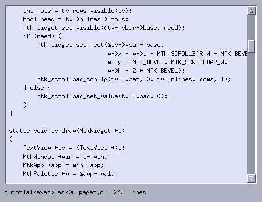

# 6. Scrolling your own content

*Program: [`examples/06-pager.c`](examples/06-pager.c)*



Part I ended with a custom widget that fit on one screen. Real
content rarely does. This chapter builds a text pager — a read-only
view over an arbitrary number of lines — and in doing so establishes
the *viewport pattern* that every scrolling widget in the toolkit
uses internally. Parts of this widget return, extended, in the log
viewer of Appendix B.

## The viewport pattern

A scrolling widget separates three quantities:

- the **content size** — how many rows exist (`nlines`);
- the **viewport size** — how many rows fit in the widget right now;
- the **offset** — the first visible row.

The offset does not live in your struct: the scrollbar *is* the
offset. `MtkScrollbar` already clamps values, maps thumb drags,
handles its arrows and paging — so the pager stores its position
exactly once, in `vbar->value`, and everything else reads it from
there. One source of truth, no synchronization bugs.

```c
typedef struct TextView {
    MtkWidget base;
    char **lines;
    int nlines;
    MtkScrollbar *vbar;
} TextView;
```

The scrollbar is created as a *child of the text view* — remember
that children draw after (on top of) their parent and receive clicks
first, which is exactly what an internal scrollbar needs.

## Keeping the scrollbar honest

Geometry and range are re-derived at the top of every draw:

```c
static void tv_sync_scrollbar(TextView *tv)
{
    MtkWidget *w = &tv->base;
    int rows = tv_rows_visible(tv);
    bool need = tv->nlines > rows;
    mtk_widget_set_visible(&tv->vbar->base, need);
    if (need) {
        mtk_widget_set_rect(&tv->vbar->base,
                            w->x + w->w - MTK_SCROLLBAR_W - MTK_BEVEL,
                            w->y + MTK_BEVEL, MTK_SCROLLBAR_W,
                            w->h - 2 * MTK_BEVEL);
        mtk_scrollbar_config(tv->vbar, 0, tv->nlines, rows, 1);
    } else {
        mtk_scrollbar_set_value(tv->vbar, 0);
    }
}
```

Doing this in `draw` looks wasteful and is anything but: draw runs
exactly when something changed (that is what damage means), so the
scrollbar tracks window resizes, content changes and theme switches
without a single explicit hook. The `page` argument
(`rows`) is what makes the thumb proportional and page-clicks scroll
by a screenful.

`mtk_scrollbar_config` is told `maxval = nlines` and
`page = rows`; the scrollbar itself derives the maximal offset
(`nlines - rows`) — never precompute that yourself.

## Painting only what is visible

```c
int top = tv->vbar->value;
mtk_set_clip(win, ...);
for (int i = 0; i < rows && top + i < tv->nlines; i++)
    mtk_draw_text_centered(win, app->font, w->x + MTK_BEVEL + 6,
                           w->y + MTK_BEVEL + i * rh, rh,
                           tv->lines[top + i], p->surface_text);
mtk_clear_clip(win);
```

Two things to notice. First, the loop is bounded by the viewport,
not the content — a million-line file costs the same per frame as a
ten-line one. Second, the clip: a row that straddles the bottom edge
would otherwise paint into whatever sits below the widget. The clip
covers every partial-row case in one stroke, and pairing it with
`mtk_clear_clip` on the same path is non-negotiable (see
[pitfalls](../docs/pitfalls.md)).

## Scrolling input

Three input paths converge on the same scrollbar:

- the scrollbar itself (drag, arrows, trough clicks) — free;
- the **wheel** over the content: buttons 4/5 in the `event` op,
  ±3 lines per notch;
- the **keyboard** in the `key` op: Up/Down, PgUp/PgDn (a screenful
  minus one line, so context carries over), Home/End, and space as
  page-down, pager tradition.

Because every path funnels into `mtk_scrollbar_set_value`, clamping
happens once and the `on_change` hook (which just damages the
window) redraws for all of them.

The `event` op returns `true` even for plain clicks it doesn't use —
that claims the click so the view (which has `can_focus = true`)
takes keyboard focus when clicked.

## Try it

```sh
./build/tutorial/examples/tut-06-pager tutorial/examples/06-pager.c
```

A pager reading its own source; scroll all three ways.

**Exercises**

1. Add a horizontal scrollbar for long lines
   (`mtk_scrollbar_create(win, parent, true)`); offset the text x
   position by its value, in pixels.
2. Show line numbers in the left margin, in `muted_text`.
3. Add `/` to focus a search entry, and make `n` jump to the next
   matching line. Appendix B builds exactly this — try it yourself
   first.

Next: [Trees and lazy data](07-trees-lazy-data.md).
