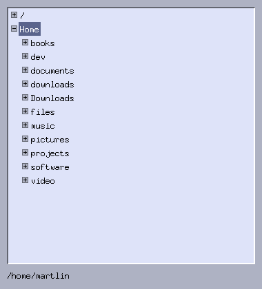

# 7. Trees and lazy data

*Program: [`examples/07-dirtree.c`](examples/07-dirtree.c)*



`MtkTree` is the one standard widget Part I skipped, because its
interesting part is not the widget — it is the *data discipline*
around it. A tree over a filesystem (or any hierarchy too large to
load whole) must populate itself lazily, and it must be able to
answer "which real thing does this node stand for?". This chapter
builds a directory browser that does both.

## Lazy population

A tree node starts life unloaded. The first time the user expands
it, the toolkit calls `on_expand`, once, and you fill in the
children:

```c
static void on_expand(MtkTree *t, MtkTreeNode *n, void *data)
{
    char path[2048];
    node_path(n, path, sizeof(path));

    /* readdir, keep the directories, sort them ... */
    for (int i = 0; i < count; i++)
        mtk_tree_node_add(t, n, names[i], nullptr);
}
```

That is the whole contract: the widget tracks `loaded` itself and
never calls you twice for the same node. Collapsing and re-expanding
is free; if the underlying data can change and you want a re-read,
`mtk_tree_node_clear` resets the children (and the node's `loaded`
flag stays your responsibility to think about — the file manager in
Appendix A simply relists on demand instead).

The consequence of laziness: the tree over `/` costs a handful of
`readdir` calls no matter how large the filesystem is, because
nothing below a collapsed node exists yet.

## Identity: what does a node *mean*?

Widgets hold labels; your program needs paths. There are two ways to
bridge that, and the example deliberately uses the cheap one:

```c
static void node_path(MtkTreeNode *n, char *buf, size_t len)
{
    if (n->user) { /* top-level roots carry their full path */
        snprintf(buf, len, "%s", (const char *)n->user);
        return;
    }
    char parent[2048];
    node_path(n->parent, parent, sizeof(parent));
    bool slash = parent[0] && parent[strlen(parent) - 1] == '/';
    snprintf(buf, len, "%s%s%s", parent, slash ? "" : "/", n->label);
}
```

Only the two roots ("/" and "Home") store anything in `user`;
every other node's path is *reconstructed* by walking its ancestry.
No allocation per node, nothing to keep consistent, nothing to free
— the tree structure itself is the data structure.

The alternative — `strdup` a full path into every node's `user` — is
sometimes right (when reconstruction is expensive or the hierarchy
isn't path-shaped), but then *you* own those strings: the tree never
frees `user`, so a clear/refresh must walk the nodes first. Prefer
reconstruction when the hierarchy allows it.

## Reacting to selection

```c
static void on_select(MtkTree *t, MtkTreeNode *n, void *data)
{
    Ui *ui = data;
    char path[2048];
    node_path(n, path, sizeof(path));
    mtk_label_set_text(ui->path_label, path);
}
```

Here it feeds a label; in Appendix A the identical callback drives a
file listing. This is the shape of every master–detail interface:
the tree owns *where you are*, a callback translates that to a real
resource, and some other widget shows *what is there*.

Interaction details you get for free: clicking the ⊞ box toggles
expansion without selecting, double-clicking a row both selects and
toggles, and the tree scrolls itself (same viewport pattern as
chapter 6, applied to the flattened list of visible rows).

## Try it

```sh
./build/tutorial/examples/tut-07-dirtree
```

Expand a few levels, then check memory usage against the size of
your filesystem — that is laziness paying off.

**Exercises**

1. Mark directories that contain no subdirectories as `leaf = true`
   during `on_expand` of their parent, so they don't show a useless
   expander. What does it cost, and when is it worth it?
2. Add a "Refresh" button that re-reads the selected node's children
   (`mtk_tree_node_clear`, then repopulate the same way `on_expand`
   does).
3. Show hidden directories when a toggle button is on. Where must
   the re-read happen?

Next: [Background work](08-background-work.md).
