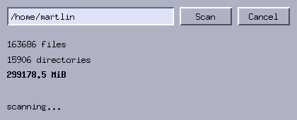

# 8. Background work

*Program: [`examples/08-dusage.c`](examples/08-dusage.c)*



libmtk is single-threaded on purpose: one thread, one X connection,
no locks. So what happens when the program has real work to do — a
directory tree with a hundred thousand files to measure? If you do
it in a callback, the window freezes until it is done. This chapter
shows the toolkit's answer: **slice the work and feed it through the
idle hook**.

## The idle contract

```c
mtk_app_set_idle(app, scan_idle, ui);
```

The hook runs when — and only when — no X events are pending and no
timer is due. It does one *slice* of work and returns `true` if more
remains; returning `false` uninstalls it. Between slices the loop
processes anything the user did, so the window keeps repainting,
buttons keep clicking, and the scrollbar keeps dragging.

The disk scanner's slice is "one directory":

```c
static bool scan_idle(void *data)
{
    Ui *ui = data;
    if (!ui->scanning || ui->nstack == 0) { ... return false; }

    char *path = ui->stack[--ui->nstack];  /* pop one directory */
    /* readdir it: files are counted, subdirectories are pushed */
    ...
    show_progress(ui);
    return ui->nstack > 0;
}
```

## Recursion without recursing

A recursive `du` would hold the entire traversal in call stack —
impossible to pause, impossible to cancel. The scanner flattens the
recursion into an explicit **work list**:

```c
char **stack;   /* directories not yet visited */
int nstack;
```

Starting a scan pushes one path. Each slice pops one directory and
pushes its subdirectories. The traversal's whole state is that
array plus three counters — which is exactly what makes the two
hard-looking features trivial:

- **Progress** is just reading the counters between slices; the
  labels update continuously because `show_progress` runs after
  every directory.
- **Cancellation** is emptying the work list. Nothing to interrupt,
  no flags checked deep inside a recursion — the next slice finds
  nothing to do:

```c
static void on_cancel(MtkButton *b, void *data)
{
    Ui *ui = data;
    clear_stack(ui);
    scan_finished(ui, "cancelled");
}
```

This transformation — recursive algorithm → explicit worklist →
resumable slices — is the general recipe, and it applies to
anything: loading thumbnails, parsing a big file (push byte ranges),
searching (push haystack chunks).

## Choosing the slice size

A slice should be big enough that per-slice overhead doesn't
dominate, and small enough that the UI never visibly stalls —
single-digit milliseconds is a good target. "One directory" is a
reasonable unit here because most directories are small; a
pathological directory with a million entries would stall once. If
that matters, make the unit "up to N entries" and keep the open
`DIR *` in your state so a slice can stop mid-directory.

Two supporting details in the example worth stealing: scans are
timed with `mtk_now_ms()` (start time in the state struct, reported
at the end), and re-arming is idempotent — clicking Scan during a
scan is simply ignored rather than corrupting the work list.

## Idle versus timers

Both run "later", but they answer different questions:

- **idle** — "use any spare time until this is done" (CPU-bound,
  finite work). It runs as fast as the event loop allows.
- **timer** — "do this *at* a point in time" (animation frames,
  polling something external). It runs at the rate you asked.

A program can use both at once; the idle hook simply yields whenever
a timer is due. Appendix B's log follower is the timer-side
counterpart of this chapter.

## Try it

```sh
./build/tutorial/examples/tut-08-dusage
```

Point it at your home directory, and while it counts: drag the
window around, press Cancel, start again. Nothing ever blocks.

**Exercises**

1. Add a "current directory" label showing the path being scanned.
   How often should it update — every slice, or throttled?
2. Change the slice unit to "50 entries" by keeping the open `DIR *`
   in the state. Measure whether it feels different on a directory
   with many thousand entries.
3. Report the largest single file found. What extra state does that
   need — and what does it *not* need?

Next: [Pixels and XRender](09-pixels-xrender.md).
