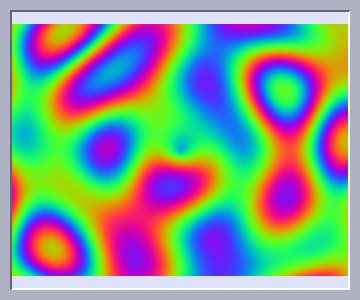

# 9. Pixels and XRender

*Program: [`examples/09-pixels.c`](examples/09-pixels.c)*



Everything so far was rectangles and text. Image viewers, plotters
and paint programs need one more capability: putting **computed
pixels** on screen, fast, and possibly scaled. This chapter builds
the complete pipeline in miniature — a CPU-rendered animation
uploaded to the X server and composited with XRender — and Appendix
C reuses it verbatim for interactive drawing.

## The pipeline

```
uint32_t buffer  --XPutImage-->  depth-32 Pixmap  --XRenderComposite-->  back buffer
   (client)                      + Picture (server)      (scaled, filtered)
```

Three facts define the pixel format, and all three come from
XRender's `PictStandardARGB32`:

1. Each pixel is one 32-bit word: `A<<24 | R<<16 | G<<8 | B`.
2. The word is in **native byte order** (the upload sets the
   XImage's `byte_order` to match the host).
3. Color channels are **premultiplied** by alpha. For opaque pixels
   (`A = 0xff`, as in this chapter) that changes nothing — but the
   moment you composite translucent pixels, forgetting this is a
   classic source of fringed, too-dark edges.

## Uploading

The `Pix` helper owns a server-side pixmap and its `Picture`:

```c
px->pm = XCreatePixmap(dpy, app->xroot, w, h, 32);
px->pict = XRenderCreatePicture(dpy, px->pm, app->fmt_argb32, 0,
                                nullptr);
```

`app->fmt_argb32` is the toolkit-provided ARGB32 picture format.
The upload itself fills in a stack `XImage` describing the buffer
(32 bits per pixel, host byte order, `bytes_per_line = w * 4`) and
pushes it with `XPutImage`. Uploading costs a full copy to the
server, so the canvas widget tracks a **dirty flag**: the buffer is
re-uploaded only in `draw`, and only when it actually changed —
damage may arrive for plenty of other reasons (window resized,
another widget invalidated, theme switched), and those repaints
reuse the picture that is already server-side.

## Compositing, scaled

Drawing the picture 1:1 is a plain `XRenderComposite`. Scaling is a
*transform on the source picture* that maps destination coordinates
back into source space — note the `1.0 / s`:

```c
XTransform xf = {{
    {XDoubleToFixed(1.0 / s), 0, 0},
    {0, XDoubleToFixed(1.0 / s), 0},
    {0, 0, XDoubleToFixed(1.0)},
}};
XRenderSetPictureTransform(app->dpy, c->pix.pict, &xf);
XRenderSetPictureFilter(app->dpy, c->pix.pict,
                        s == 1.0 ? FilterNearest : FilterBilinear,
                        nullptr, 0);
XRenderComposite(app->dpy, PictOpOver, c->pix.pict, None,
                 win->back_pict, 0, 0, 0, 0, dx, dy, dw, dh);
```

The composite targets `win->back_pict` — the XRender face of the
same back buffer all core drawing uses, so pixels and bevels mix
freely. And because `mtk_set_clip` clips *both* faces, wrapping the
composite in a clip keeps a scaled image inside your rectangle
exactly like text.

One honest caveat: bilinear filtering is good between 0.5× and any
upscale, but *strong minification* (fitting a large image into a
small widget) aliases — bilinear only ever samples four source
pixels. The fix is to pre-shrink on the CPU (averaging blocks —
which premultiplied pixels make correct) to about twice the target
size, then let bilinear do the rest. This example never minifies
below 0.5×, so it skips that step; a real image viewer must not.

## Animating

The plasma is chapter 2's timer pattern driving chapter 9's
pipeline: a one-shot timer re-adds itself every 50 ms, recomputes
the buffer, sets the dirty flag and damages the window. Note the
division of labor — the timer callback *never draws*; it changes
state and lets the draw pass upload and composite. That way a
resize, an expose and an animation frame all take the identical
path.

## Try it

```sh
./build/tutorial/examples/tut-09-pixels
```

Resize the window: the plasma scales smoothly, and the aspect ratio
holds because the draw handler letterboxes inside the widget.

**Exercises**

1. Render into a buffer 4× larger and let the transform scale it
   down below 0.5×. Watch the aliasing appear, then fix it with a
   CPU box-average to 2× the target before upload.
2. Make a click teleport the plasma's center (`hypot` term) to the
   clicked point — canvas coordinates are
   `ev->xbutton.x - w->x` scaled by the current `s`.
3. Draw a text overlay (an FPS counter) *after* the composite in the
   same draw handler, with `mtk_draw_text_centered`.

Next: the appendices put everything to work —
[A: a file manager](a-file-manager.md),
[B: a log viewer](b-log-viewer.md),
[C: a paint program](c-paint-program.md).
