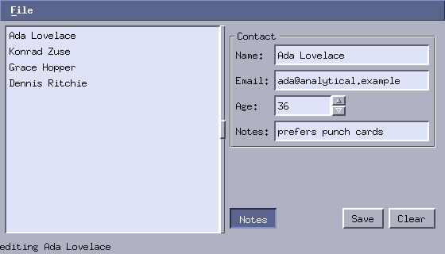
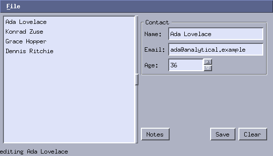

# 10. Layouts

*Program: [`examples/10-contacts.c`](examples/10-contacts.c)*



Nine chapters of `layout()` functions taught you the primitive:
absolute rectangles, positioned by arithmetic, on every resize. This
chapter introduces the layer that makes most of those functions
unnecessary — **layout trees** — and builds a contact editor whose
window has *no geometry code at all*: no `layout()`, no `on_resize`,
not one coordinate outside the widget constructors.

## Geometry trees

A layout is a tree of nodes describing how a rectangle should be
divided. Nodes are not widgets: they don't draw, they receive no
events, and applying the tree simply ends in the same
`mtk_widget_set_rect` calls you have been writing by hand. The whole
contact editor window is one expression:

```c
mtk_window_set_layout(a.win, mtk_lay_appframe(&a.menubar->base,
    mtk_lay_pad(mtk_lay_split(a.sash,
        mtk_lay_min(mtk_lay_widget(&a.list->base), 120, 0),
        mtk_lay_pad(mtk_lay_col(8,
            mtk_lay_framed(a.frame, mtk_lay_grid(2, 6,
                mtk_lay_widget(&l_name->base),
                mtk_lay_widget(&a.name->base),
                mtk_lay_widget(&l_email->base),
                mtk_lay_widget(&a.email->base),
                mtk_lay_widget(&l_age->base),
                mtk_lay_align(mtk_lay_widget(&a.age->base),
                              MTK_LAY_START, MTK_LAY_FILL),
                mtk_lay_widget(&a.notes_label->base),
                mtk_lay_widget(&a.notes->base),
                nullptr)),
            mtk_lay_spacer(),
            mtk_lay_row(6,
                mtk_lay_widget(&a.toggle->base),
                mtk_lay_spacer(),
                mtk_lay_widget(&a.save->base),
                mtk_lay_widget(&a.clear->base),
                nullptr),
            nullptr), 6)),
        6),
    &a.status->base));
```

Read it inside out and it is the window: an application frame
(menubar / content / statusbar); the content is a sash-split pair;
the left pane is the list; the right pane is a column of a titled
frame, a stretchable gap, and a button row.

`mtk_window_set_layout` hands ownership of the tree to the window,
applies it immediately, and re-applies it on every resize — before
`on_resize`, which still fires afterwards if you want manual tweaks
on top.

## Where the sizes come from

Nothing in that tree says a button is 26 pixels tall. Sizing is
resolved per axis, in order:

1. **fixed** — you said so (`mtk_lay_fixed`, `mtk_lay_wfix`);
2. **natural** — the widget's `measure` op reports its preferred
   size: buttons measure their label, entries are one row high and
   elastically wide, the menu bar is `MTK_MENUBAR_H`. Custom widgets
   without a `measure` op are elastic;
3. **stretch** — whatever is left is shared between elastic nodes by
   weight (`mtk_lay_stretch`, and `mtk_lay_spacer()` is just an
   empty weight-1 node).

That is why the button row works the way it does: `Notes` sizes to
its label, the spacer soaks up the middle, `Save` and `Clear` end up
right-aligned — the classic dialog row from a one-line pattern.

The grid does the equivalent for forms: each column is as wide as
its widest natural cell, so the label column fits "Email:" exactly
and the entry column takes the rest. Adding a row never disturbs the
rows above it.

Two policy notes from the example worth noticing:

- the age spinbox is `mtk_lay_align(..., MTK_LAY_START, ...)` — its
  natural width is 90, and *aligning* it start keeps it that size
  instead of filling the cell like the entries do;
- the list pane is `mtk_lay_min(..., 120, 0)` — minimums feed the
  split's clamping, so the sash cannot crush the list.

## The split owns the sash

```c
mtk_lay_split(a.sash, left, right)
```

positions both panes *and* the sash, remembers the split across
resizes, clamps dragging against the panes' minimums, and wires the
sash's `on_drag` itself — the application no longer stores a split
position, and the class of bug where the sash and its neighbours
disagree about an edge can no longer be written. (If you followed
the appendices: that is exactly the mfm status-bar bug, retired.)

## Visibility collapses



The `Notes` toggle hides the notes label and entry:

```c
static void on_toggle_notes(MtkButton *b, void *data)
{
    App *a = data;
    mtk_widget_set_visible(&a->notes_label->base, b->toggled);
    mtk_widget_set_visible(&a->notes->base, b->toggled);
}
```

That is the entire handler. A hidden widget's node collapses — no
space, no gap — and the window relayouts automatically: the grid
loses its row, the frame shrinks around the smaller grid, everything
below moves up. Compare the two screenshots. The same mechanism
drives bigger mode switches: put whole panels in a `mtk_lay_stack`
(they share one rectangle) and toggle which one is visible — the
tab-switched panes of a real application in two lines per switch.

`mtk_lay_keep_space(node)` opts out when you want a hidden widget to
keep its hole.

## Mixing with manual layout

Layouts are optional, per window and even per region. The primitive
from chapter 1 is unchanged and fully supported; a hand-written
`on_resize` can delegate any rectangle to a subtree:

```c
static void my_layout(MtkWindow *win)
{
    Ui *ui = win->user;
    /* place the weird part by hand ... */
    mtk_widget_set_rect(&ui->canvas->base, cx, cy, cw, ch);
    /* ... and let a tree handle the settings panel */
    mtk_lay_apply(ui->panel_lay, px, py, pw, ph);
}
```

Trees used this way are yours to free (`mtk_lay_free`); trees given
to `mtk_window_set_layout` belong to the window. Nodes never own
widgets — widget lifetime rules are unchanged either way.

## Try it

```sh
./build/tutorial/examples/tut-10-contacts
```

Resize the window every way you can, drag the sash, toggle the
notes row. Then open `10-contacts.c` and count the coordinates in
it: the only numbers are gaps, pads and two minimums.

**Exercises**

1. Add a "Phone:" row to the grid. One statement — notice what you
   did *not* have to touch.
2. Replace the right pane with a `mtk_lay_stack` of the form and a
   large "no contact selected" label; switch visibility from
   `on_select` and a Deselect button.
3. Rebuild chapter 3's to-do app with a layout tree. Its `layout()`
   is only eight lines — is the tree actually better? Form an
   opinion; the primitive is not going anywhere.
4. Write `measure` for chapter 4's light board (a natural 300×300,
   say) and see how it changes what a layout does with it.

Next: the appendices put everything to work —
[A: a file manager](a-file-manager.md),
[B: a log viewer](b-log-viewer.md),
[C: a paint program](c-paint-program.md).
