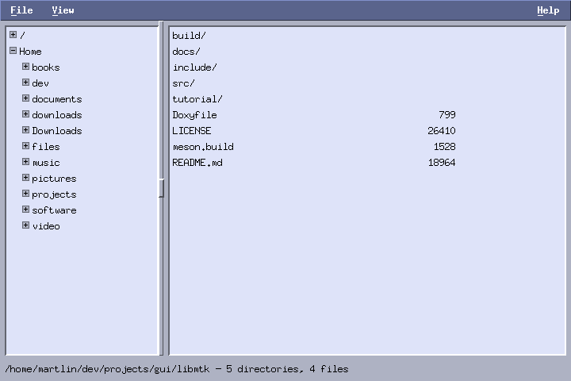

# Appendix A: a file manager

*Program: [`examples/a-mfm.c`](examples/a-mfm.c) (~450 lines)*



The first full application: **mfm**, a two-pane file manager.
Directory tree on the left, file listing on the right, a draggable
sash between them, menus with mnemonics, and real file operations —
create, rename, delete — guarded by dialogs. Nothing in it is new;
the point of this appendix is watching the pieces from nine chapters
click together into a program you would actually use.

Read the source top to bottom alongside this page; each section
below names the chapter that introduced its machinery.

## The shape of the program

```
App
├─ menubar          File / View / Help(right)        (ch 5)
├─ tree             lazy directory tree              (ch 7)
├─ sash             draggable split                  (ch 2)
├─ list             multi-select file listing        (ch 3)
└─ status           one label, all feedback
```

One `App` struct owns every widget plus the model state: the current
directory and — important — `names`, an array of plain basenames
parallel to the listbox rows. The listbox displays *formatted* rows
(`"meson.build      1528"`); operating on files needs the real
names. Keeping a parallel array, and rebuilding both together in
`list_dir`, is the same display-versus-model split the slideshow
pattern from chapter 3 used.

## Master–detail wiring

The tree's `on_select` reconstructs the node's path (chapter 7's
ancestry walk) and hands it to `list_dir`. That function is the
heart of the program and entirely un-clever: read the directory,
split into directories and files, sort each, fill the listbox and
the `names` array, update the status line. Every mutation in the
program ends by calling it again — after mkdir, rename, delete,
refresh, hidden-toggle. **Re-list instead of patching** costs a few
milliseconds and eliminates the entire class of
"list-out-of-sync-with-disk" bugs.

Double-clicking a directory row descends into it (`on_activate`,
checking the entry with `stat`). Note what it does *not* do: it
does not try to synchronize the tree's expansion state with the
listing. The tree is a navigation aid, not a mirror; resisting the
urge to keep two views bidirectionally synced is a genuine design
lesson — pick one owner for "where are we" (here: `a->curdir`) and
let other views lag benignly.

## Operations and their guards

The three mutating operations share one dialog toolkit, extended
from chapter 5:

- `prompt_show` — entry + OK/Cancel, calls back with text (used for
  New Directory and Rename);
- `confirm_show` — question + Delete/Cancel, calls back with a
  dummy value (used before deleting).

Both park their state in `win->user`, free it in `on_destroy`, and
copy everything out *before* `mtk_window_destroy` — the
copy-then-destroy-then-continue shape, again.

Deletion honors the chapter-3 selection model: every marked row, or
the lead row when nothing is marked — and iterates **backwards**,
because removing a row shifts the ones after it. It deliberately
uses `rmdir` (not a recursive delete): empty directories vanish,
non-empty ones fail politely into the status line. A tutorial
program should not wield `rm -rf`; extending it safely is exercise
territory.

Errors go through `strerror(errno)` into the status label — one
line, and every failure mode (permissions, non-empty directory,
vanished file) gets an honest message.

## Small choices worth noticing

- The sash constrains itself (`min_x`, `max_x` set in layout) so
  neither pane can collapse; its callback stores the split and
  re-runs layout — three lines, resizable UI.
- The file size column is just `printf` alignment — with a bitmap
  font at a fixed size, column layout in a listbox is `%-40s %10lld`
  and nothing more.
- `Alt+F`, `Alt+V`, `Alt+H` and the right-attached Help menu come
  from routing `on_key` through `mtk_menubar_key` — one line.

## Try it

```sh
./build/tutorial/examples/tut-a-mfm /tmp
```

Point it somewhere disposable and exercise the whole surface:
create a directory, rename it, Ctrl-click a few entries, press
Delete, drag the sash, toggle hidden files.

**Exercises**

1. Add an "Open Terminal Here" File-menu item (`fork` + `execlp` of
   `$TERM` with the right working directory).
2. Show a second status segment with the *selected* size total,
   updated from `on_select`.
3. Make Backspace go to the parent directory. Where does the ".."
   path come from, and what should happen at "/"?
4. (Bigger) Recursive delete, done honestly: reuse chapter 8's
   worklist so a huge tree deletes without freezing, with a live
   count and a Cancel button.
