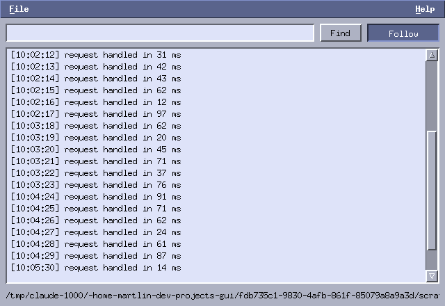

# Appendix B: a log viewer

*Program: [`examples/b-tailview.c`](examples/b-tailview.c) (~450 lines)*



**tailview** opens a text file, scrolls through it, searches it —
and, with the Follow toggle on, behaves like `tail -f`: new lines
appear as the file grows, and the view sticks to the end. It is
chapter 6's pager grown into a tool, with chapter 8's timing model
driving the live part.

## Storing a growing file

The pager copied each line into its own allocation — fine for a
fixed file, wasteful for one that grows all day. `LogView` stores
the file as **one byte buffer plus an index of line starts**:

```c
char *data;      /* the whole file, appended to as it grows */
long len, cap;
long *starts;    /* byte offset where each line begins */
int nlines;
```

Appending is `memcpy` into the (doubling) buffer, and — the detail
that makes following cheap — indexing is *incremental*:
`lv_index_from(lv, old_len)` scans only the newly appended bytes for
newlines. A day-long log never gets re-scanned; each poll pays only
for what arrived.

Rendering pulls one line out at a time (`lv_line` copies the span
between two starts, trimming the newline) into a stack buffer.
Nothing else changed from chapter 6: same scrollbar-as-offset, same
clip, same three input paths. The one addition is `hilite`, a row
index painted with `primary`/`primary_text` — the search result
marker.

## Following: a timer, not a thread

Follow mode is a poll loop built from the standard self-rescheduling
timer:

```c
static void poll_tick(void *data)
{
    App *a = data;
    a->poll_timer = 0;
    if (!a->follow->toggled)
        return;                     /* toggled off: chain stops */
    struct stat st;
    if (stat(a->path, &st) == 0 && (long)st.st_size > a->read_pos)
        if (read_more(a)) {
            lv_scroll_to_end(a->view);
            update_status(a);
        }
    a->poll_timer = mtk_timer_add(a->mtk, 500, poll_tick, a);
}
```

Three details carry the weight:

- **`read_pos`** — the application remembers how many bytes it has
  consumed. Each poll `stat`s the file and only opens/reads when
  there is genuinely more, so an idle log costs one `stat` every
  half second.
- **The chain stops itself.** Toggling Follow off doesn't cancel
  anything; the next tick sees the toggle and declines to
  reschedule. Toggling it on calls `poll_tick` directly (guarded by
  `poll_timer` so two chains can never run at once).
- **Autoscroll is a policy, not a mechanism**: it is one
  `mtk_scrollbar_set_value(vbar, nlines)` after appending. If you
  wanted "don't yank the view if the user scrolled up" — the
  behavior serious log viewers have — it is a two-line condition on
  whether the view *was* at the end before appending. That is
  exercise 2.

Why poll instead of inotify? Portability and size — `stat` twice a
second is invisible, works on every Unix and on network mounts, and
keeps the appendix focused. The structure wouldn't change with
inotify: its file descriptor would simply replace the timer as the
thing that triggers `read_more`.

## Search

Search walks lines from `hilite + 1`, wrapping, `strstr` per line;
a hit sets `hilite` and centers it by setting the scrollbar to
`i - rows/2` (the scrollbar clamps, so edges need no special
cases). Pressing Return in the entry and clicking Find share one
function — the entry's `on_activate` making "type, Enter, Enter,
Enter" the natural rhythm for stepping through matches.

## Try it

```sh
./build/tutorial/examples/tut-b-tailview /var/log/messages   # or any file
# in another terminal, watch it live:
( while true; do date >> /tmp/demo.log; sleep 1; done ) &
./build/tutorial/examples/tut-b-tailview /tmp/demo.log       # toggle Follow
```

**Exercises**

1. Show the match count ("3/17") next to Find. When must it be
   recomputed?
2. Sticky autoscroll: only jump to the end if the view was already
   at the end before the append.
3. Handle truncation (logrotate): if `st_size < read_pos`, reset
   and reload.
4. Case-insensitive search. `strcasestr` is nonstandard — write the
   loop yourself, and mind UTF-8: compare bytes, not "characters".
