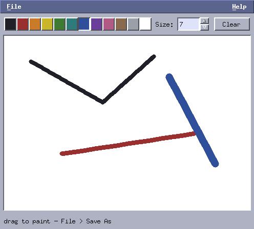

# Appendix C: a paint program

*Program: [`examples/c-mpaint.c`](examples/c-mpaint.c) (~430 lines)*



**mpaint** closes the tutorial: a pixel canvas you draw on with the
mouse, a color palette, a brush-size spinbox, Clear, and Save As
(PPM). Where chapter 9's pixels changed on a timer, these change
under the pointer — the missing piece is *interactive* pixel
editing, and the answer is a straight combination of the drag
pattern (chapter 4) with the upload pipeline (chapter 9).

## The canvas: model first

The painting is **not** the window contents. It is a plain array —

```c
uint32_t *buf;    /* CAN_W x CAN_H, opaque ARGB */
```

— and everything else is derived from it. Drawing mutates the
buffer and sets `dirty`; the draw handler uploads (only when dirty)
and composites 1:1 with `PictOpSrc`, no transform, no filter —
pixel-exact by construction. Because the model is just memory,
Save-As is a `fwrite` loop and an eventual Undo (exercise 4) is a
buffer copy. Programs that instead draw straight to the screen have
no model to save.

## Strokes, not points

Motion events arrive at whatever rate the server delivers — drag
fast and consecutive events can be 40 pixels apart. Stamping the
brush only at event positions would leave a dotted line, so the
canvas remembers the previous point and stamps *along the segment*:

```c
static void canvas_stroke(Canvas *c, int x0, int y0, int x1, int y1)
{
    int steps = (int)hypot(x1 - x0, y1 - y0);
    if (steps < 1)
        steps = 1;
    for (int i = 0; i <= steps; i++)
        canvas_stamp(c, x0 + (x1 - x0) * i / steps,
                     y0 + (y1 - y0) * i / steps);
    c->dirty = true;
    mtk_window_damage(c->base.win);
}
```

The event op is the chapter-4 press/motion/release triple: press
records the point and stamps once (a click is a dot), motion strokes
from the remembered point, release ends the gesture. The toolkit's
mouse grab guarantees the release arrives even if the pointer leaves
the canvas mid-stroke.

The brush itself (`canvas_stamp`) is a filled circle with edge
clamping — clamping in the *stamp*, once, means stroke geometry
never worries about the border.

## Two custom widgets, one lesson each

The **palette** is the smallest useful custom widget in the whole
tutorial: twelve fixed colors, cells drawn with `mtk_fill_rect` +
`mtk_draw_bevel` (selected cell sunken — state shown Motif-style, by
relief), hit-testing by division. It reports picks through an
`on_pick` hook rather than poking the canvas directly, so it stays
reusable — the application is the only place that knows both widgets
exist:

```c
static void pick_color(Palette *p, uint32_t color, void *data)
{
    App *a = data;
    a->canvas->color = color;
}
```

The **canvas** shows the flip side: it exposes plain fields
(`color`, `brush`) instead of hooks, because it is the *consumer* of
state, not a producer of events the application must hear about.
Choosing between "field the app sets" and "hook the app receives" is
most of custom-widget API design.

The spinbox needs no adapter at all — its `on_change` reads
`mtk_spinbox_value` into `canvas->brush`, and wheel-scrolling the
spinbox works because chapter 3 said it would.

## Saving

PPM (`P6`) is the format you can write in eight lines with zero
dependencies: a text header, then raw RGB triplets — dropping each
pixel's alpha byte on the way out. The Save-As dialog is the
unchanged prompt pattern; `convert painting.ppm painting.png` covers
everyone who wants a modern format, and doing it natively is what
libpng is for, in a real program.

## Try it

```sh
./build/tutorial/examples/tut-c-mpaint
```

Draw something. Change color mid-stroke (you can — the palette
works during a drag, because the grab belongs to the canvas, not the
application). Save it and open the PPM in any viewer.

**Exercises**

1. An eraser is white paint — but make it a *tool*: remember the
   pre-pick color so switching back is one click.
2. Add line and rectangle tools: stamp nothing during motion, draw
   the shape once on release. (Preview-while-dragging needs the
   shape drawn in the *draw handler* from gesture state — why?)
3. Flood fill on double click (`win->click_double` + an explicit
   worklist — chapter 8's trick again; recursion will blow the
   stack on big areas).
4. Undo: snapshot the buffer on ButtonPress into a small ring of
   copies; `Ctrl+Z` restores. At 480×340×4 bytes, how many levels
   can you afford?

---

That is the end of the tutorial. You have built eleven programs and
three of them are genuinely useful. The [toolkit
reference](../README.md) and the [pitfalls list](../docs/pitfalls.md)
are the documents to keep open while you build the twelfth — yours.
